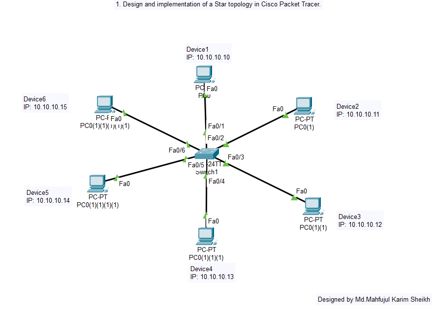
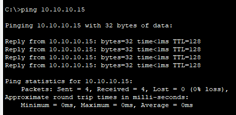

# Experiment 01: Design and Implementation of a Star Topology

## 📋 Overview
A **Star Topology** is a network architecture where all end devices (such as PCs, workstations, and printers) are connected individually to a central network device—typically a **Switch** or **Hub**. In this lab, Cisco Packet Tracer is utilized to build, configure, and verify end-to-end communication across 6 PCs connected to a central 24-port Cisco Switch.

---

## 🎯 Objectives
- Understand the architectural structure and communication model of a Star Topology.
- Configure end devices (PCs) with static IP addresses and appropriate subnet masks.
- Interconnect end devices with a central Cisco 2960 Switch using straight-through Ethernet cabling.
- Test and verify network reachability using the `ping` utility and Cisco Packet Tracer Simulation Mode.
- Analyze the advantages (scalability, easy fault isolation) and limitations (single point of failure at switch) of star topology.

---

## 🛠️ Hardware & Software Requirements
| Device / Tool | Specifications | Quantity |
| :--- | :--- | :--- |
| **Central Switch** | Cisco Catalyst 2960-24TT | 1 |
| **End Devices** | Desktop PCs (PC0 - PC5) | 6 |
| **Transmission Media** | Copper Straight-Through Cables (FastEthernet) | 6 |
| **Simulation Tool** | Cisco Packet Tracer v8.x+ | - |

---

## 📐 Network Topology Design
Each host connects via its `FastEthernet0` port directly to one of the switch's `FastEthernet0/x` ports.

```
       [PC 0]       [PC 1]
         \             /
          \           /
    [PC 5]--[ Switch ]--[PC 2]
          /     |     \
         /      |      \
       [PC 4]   |     [PC 3]
```

### Topology Simulation in Cisco Packet Tracer


---

## 🔢 Addressing Scheme
| Device Name | Interface | IP Address | Subnet Mask | Default Gateway |
| :--- | :--- | :--- | :--- | :--- |
| **PC0** | FastEthernet0 | `192.168.1.1` | `255.255.255.0` | N/A (Local LAN) |
| **PC1** | FastEthernet0 | `192.168.1.2` | `255.255.255.0` | N/A (Local LAN) |
| **PC2** | FastEthernet0 | `192.168.1.3` | `255.255.255.0` | N/A (Local LAN) |
| **PC3** | FastEthernet0 | `192.168.1.4` | `255.255.255.0` | N/A (Local LAN) |
| **PC4** | FastEthernet0 | `192.168.1.5` | `255.255.255.0` | N/A (Local LAN) |
| **PC5** | FastEthernet0 | `192.168.1.6` | `255.255.255.0` | N/A (Local LAN) |

---

## ⚙️ Step-by-Step Procedure
1. **Workspace Setup**: Open Cisco Packet Tracer and add a Cisco 2960 Switch to the canvas.
2. **Deploy Nodes**: Place 6 generic PCs symmetrically around the central switch.
3. **Cabling**: Use **Copper Straight-Through Cables** to link each PC's `FastEthernet0` to available switch ports (`Fa0/1` through `Fa0/6`).
4. **IP Configuration**:
   - Click on each PC -> Navigate to **Desktop** tab -> **IP Configuration**.
   - Select **Static** and assign the IP address and subnet mask according to the addressing table above.
5. **Port Convergence**: Allow the switch port lights to turn from amber (Spanning Tree Protocol listening/learning state) to green (forwarding state).
6. **Connectivity Verification**:
   - Open PC0's **Command Prompt** and execute:
     ```cmd
     ping 192.168.1.2
     ping 192.168.1.6
     ```
   - Observe 0% packet loss and fast round-trip times.

---

## 📊 Results & Verification
All 6 PCs communicate seamlessly through the central switch without collision.



### Key Observations:
- In contrast to a hub, the switch maintains a **MAC address table** (`CAM table`) and forwards unicast frames only to the target port.
- Disconnecting any single PC cable does not affect communication between remaining PCs.
