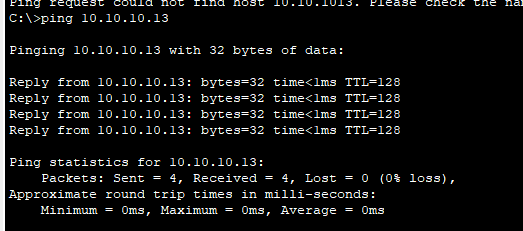

# Experiment 02: Design and Implementation of a Mesh Topology

## 📋 Overview
In a **Mesh Topology**, devices are interconnected such that every node has dedicated point-to-point links to other nodes (either fully connected or partially connected). This architecture provides the highest redundancy and fault tolerance in mission-critical networks. In this experiment, a mesh network structure with 6 nodes/switches is designed and verified using Cisco Packet Tracer.

---

## 🎯 Objectives
- Understand the concepts, mathematics, and operational architecture of Mesh Topologies.
- Compute link requirements using the formula:
  $$\text{Total Links (Full Mesh)} = \frac{N(N - 1)}{2}$$
  *(For $N = 6$ nodes, total required physical links = $\frac{6 \times 5}{2} = 15$ links).*
- Implement a multi-switch interconnected mesh in Cisco Packet Tracer.
- Observe how Spanning Tree Protocol (STP) prevents Layer 2 broadcast storms and loops in redundant switched topologies.
- Verify communication reliability and alternate path failover using the `ping` utility.

---

## 🛠️ Hardware & Software Requirements
| Device / Tool | Specifications | Quantity |
| :--- | :--- | :--- |
| **Switches** | Cisco Catalyst 2960-24TT | 6 |
| **End Devices** | Desktop PCs | 6 |
| **Transmission Media** | Copper Straight-Through & Cross-Over Cables | Multiple |
| **Simulation Tool** | Cisco Packet Tracer v8.x+ | - |

---

## 📐 Network Topology Design
The simulation model arranges switches in a mesh backbone with host PCs connected to each switch node. Redundant links ensure that if any single link fails, packets can automatically route through alternate paths.

### Topology Simulation in Cisco Packet Tracer

---

## 🔢 Addressing Scheme
| Node / Host | Connected Switch | Interface | IP Address | Subnet Mask |
| :--- | :--- | :--- | :--- | :--- |
| **PC0** | Switch 0 | FastEthernet0 | `192.168.10.1` | `255.255.255.0` |
| **PC1** | Switch 1 | FastEthernet0 | `192.168.10.2` | `255.255.255.0` |
| **PC2** | Switch 2 | FastEthernet0 | `192.168.10.3` | `255.255.255.0` |
| **PC3** | Switch 3 | FastEthernet0 | `192.168.10.4` | `255.255.255.0` |
| **PC4** | Switch 4 | FastEthernet0 | `192.168.10.5` | `255.255.255.0` |
| **PC5** | Switch 5 | FastEthernet0 | `192.168.10.6` | `255.255.255.0` |

---

## ⚙️ Step-by-Step Procedure
1. **Node Layout**: Place 6 Cisco 2960 Switches on the canvas arranged hexagonally or in a ring-mesh pattern.
2. **Inter-Switch Links**: Connect switch interfaces with Copper Cross-Over (or Auto-MDIX Straight-Through) cables to form a redundant mesh.
3. **Attach End Devices**: Connect each PC to its corresponding switch with a straight-through cable.
4. **Addressing**: Assign unique IP addresses in the same local subnet (`192.168.10.0/24`) across all 6 PCs.
5. **Observe STP Convergence**: Notice that Cisco Catalyst switches will place some redundant ports into blocking (amber) state to eliminate switching loops.
6. **Ping Test**: Send ICMP echo requests between various pairs of PCs across the mesh backbone.

---

## 📊 Results & Verification
Connectivity across all pairs of PCs is successfully verified with 0% packet loss.

### Key Insights:
- **Fault Tolerance**: If any intermediate switch or cable is severed, the network continues to operate without total communication loss.
- **Complexity vs Reliability**: Mesh topologies provide maximum redundancy at the cost of high cabling complexity and hardware expense.
