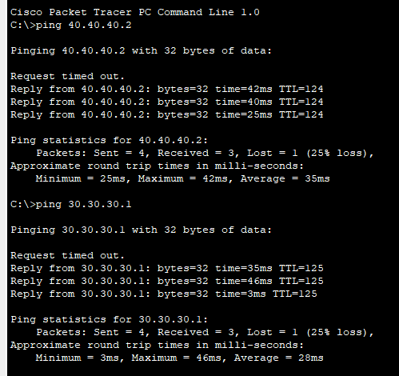

# Experiment 03: Static Routing Configuration for Interconnected Networks

## 📋 Overview
**Static Routing** is a method where network routes are manually entered into a router's routing table by a network administrator. Static routes remain fixed unless modified manually. In this experiment, a multi-router network (covering both 3-router and 4-router topologies) is configured and tested in Cisco Packet Tracer to enable full inter-network communication across different subnets.

---

## 🎯 Objectives
- Understand how routers examine destination IP addresses and consult their internal routing tables to forward packets.
- Configure IPv4 addresses on Router interfaces (FastEthernet, GigabitEthernet, and Serial).
- Understand and apply the Cisco IOS static route command syntax:
  ```ios
  Router(config)# ip route <destination_network> <subnet_mask> <next_hop_ip | exit_interface>
  ```
- Establish bidirectional routing across 4 interconnected subnetworks.
- Verify end-to-end routing with `ping` and `traceroute`.

---

## 🛠️ Hardware & Simulation Requirements
| Component | Specifications | Quantity |
| :--- | :--- | :--- |
| **Routers** | Cisco 1841 / 2811 / 2901 Series | 3 to 4 |
| **Switches** | Cisco Catalyst 2960-24TT | 3 to 4 |
| **Host Devices** | Desktop PCs / Workstations | 6 to 8 |
| **Cabling** | Serial DTE/DCE Cables & Copper Straight-Through | As required |
| **Tool** | Cisco Packet Tracer v8.x+ | - |

---

## 📐 Network Topology Design
Each router services its own local area network (LAN) containing a switch and connected PCs. Routers are interconnected in series or ring via point-to-point serial or Ethernet WAN links.

### Topology Simulation in Cisco Packet Tracer


---

## 🔢 Subnet & Interface Addressing Plan
| Network Segment | Subnet Address | Router Interface | IP Address | Purpose |
| :--- | :--- | :--- | :--- | :--- |
| **LAN 1** | `192.168.1.0/24` | Router 0 - Fa0/0 | `192.168.1.1` | Gateway for PC0, PC1 |
| **LAN 2** | `192.168.2.0/24` | Router 1 - Fa0/0 | `192.168.2.1` | Gateway for PC2, PC3 |
| **LAN 3** | `192.168.3.0/24` | Router 2 - Fa0/0 | `192.168.3.1` | Gateway for PC4, PC5 |
| **LAN 4** | `192.168.4.0/24` | Router 3 - Fa0/0 | `192.168.4.1` | Gateway for PC6, PC7 |
| **WAN 1-2** | `10.0.0.0/30` | R0-Se0/0/0 ↔ R1-Se0/0/0 | `10.0.0.1` / `10.0.0.2` | Inter-router link R0-R1 |
| **WAN 2-3** | `10.0.0.4/30` | R1-Se0/0/1 ↔ R2-Se0/0/0 | `10.0.0.5` / `10.0.0.6` | Inter-router link R1-R2 |
| **WAN 3-4** | `10.0.0.8/30` | R2-Se0/0/1 ↔ R3-Se0/0/0 | `10.0.0.9` / `10.0.0.10` | Inter-router link R2-R3 |

---

## 💻 Cisco IOS Configuration Commands

### 1. Interface IP Configuration (Example on Router 0):
```ios
Router> enable
Router# configure terminal
Router(config)# hostname Router0
Router0(config)# interface FastEthernet0/0
Router0(config-if)# ip address 192.168.1.1 255.255.255.0
Router0(config-if)# no shutdown
Router0(config-if)# exit

Router0(config)# interface Serial0/0/0
Router0(config-if)# ip address 10.0.0.1 255.255.255.252
Router0(config-if)# clock rate 64000
Router0(config-if)# no shutdown
Router0(config-if)# exit
```

### 2. Static Route Definitions:
On **Router 0** to reach remote LANs:
```ios
Router0(config)# ip route 192.168.2.0 255.255.255.0 10.0.0.2
Router0(config)# ip route 192.168.3.0 255.255.255.0 10.0.0.2
Router0(config)# ip route 192.168.4.0 255.255.255.0 10.0.0.2
```

On **Router 1** (Intermediate Router):
```ios
Router1(config)# ip route 192.168.1.0 255.255.255.0 10.0.0.1
Router1(config)# ip route 192.168.3.0 255.255.255.0 10.0.0.6
Router1(config)# ip route 192.168.4.0 255.255.255.0 10.0.0.6
```

---

## 📊 Results & Verification
Cross-network reachability is confirmed by executing ping tests from a PC on LAN 1 to PCs on LAN 2, LAN 3, and LAN 4.



### Verification Commands:
```ios
Router# show ip route
Router# show ip interface brief
```

---

## 📁 Included Simulation Files
- [`four_router_static.pkt`](./four_router_static.pkt): Complete 4-router static network topology.
- [`three_router_static.pkt`](./three_router_static.pkt): Standard 3-router static configuration.
- [`static_network_config_corrected.pkt`](./static_network_config_corrected.pkt): Verified and debugged static routing topology.
- [`three_router_static_alt.pkt`](./three_router_static_alt.pkt): Alternative 3-router test setup.
