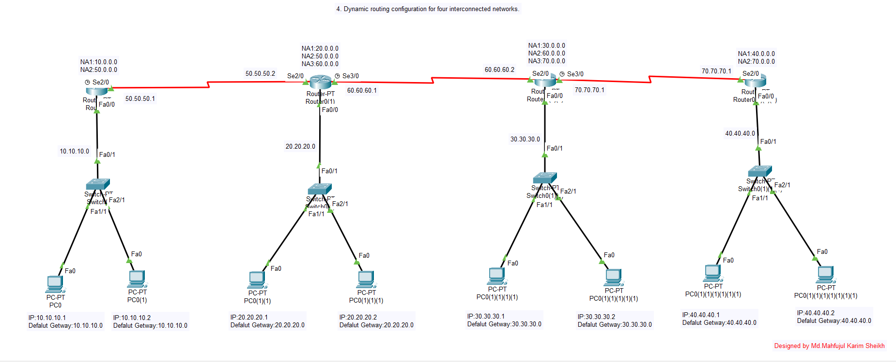
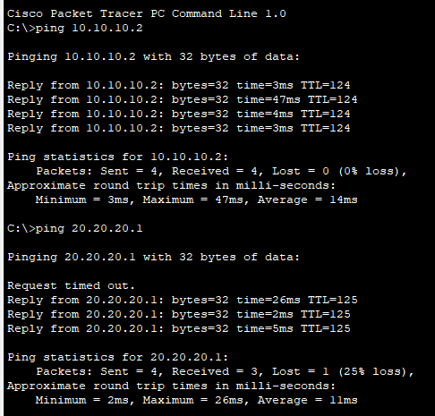

# Experiment 04: Dynamic Routing Configuration for Interconnected Networks

## 📋 Overview
Unlike static routing, **Dynamic Routing** protocols enable routers to automatically discover remote networks, dynamically maintain and update routing tables, and compute optimal alternate paths in real time when topology changes occur. In this experiment, dynamic routing is deployed across interconnected routers using **RIP (Routing Information Protocol)** and **OSPF (Open Shortest Path First)** in Cisco Packet Tracer.

---

## 🎯 Objectives
- Understand the underlying theory of interior gateway protocols (IGPs), specifically distance-vector (RIP) and link-state (OSPF).
- Enable dynamic routing protocols across interconnected routers.
- Verify automatic route advertisement and metric calculation.
- Compare dynamic routing convergence speed with static route maintenance overhead.
- Verify end-to-end multi-hop data transmission.

---

## 🛠️ Hardware & Simulation Requirements
| Component | Specifications | Quantity |
| :--- | :--- | :--- |
| **Routers** | Cisco 1841 / 2811 Series | 3 to 4 |
| **Switches** | Cisco Catalyst 2960-24TT | 3 to 4 |
| **Host Devices** | Desktop PCs | 6 to 8 |
| **Cabling** | Serial DTE/DCE & FastEthernet Cables | As needed |
| **Software** | Cisco Packet Tracer v8.x+ | - |

---

## 📐 Network Topology Design
The topology interconnects multiple routers where each router advertises its directly connected networks to its neighboring routers.

### Topology Simulation in Cisco Packet Tracer


---

## 💻 Cisco IOS Dynamic Routing Configuration

### Method 1: RIPv2 (Routing Information Protocol v2)
On each router, enter global configuration mode and declare directly connected network class boundaries:

```ios
Router> enable
Router# configure terminal
Router(config)# router rip
Router(config-router)# version 2
Router(config-router)# no auto-summary
Router(config-router)# network 192.168.1.0
Router(config-router)# network 10.0.0.0
Router(config-router)# exit
```

### Method 2: OSPF (Open Shortest Path First - Single Area 0)
Alternative link-state configuration using wildcard masks:

```ios
Router(config)# router ospf 1
Router(config-router)# network 192.168.1.0 0.0.0.255 area 0
Router(config-router)# network 10.0.0.0 0.0.0.3 area 0
Router(config-router)# exit
```

---

## 📊 Results & Verification
Once routers converge, they populate their routing tables with `R` (RIP) or `O` (OSPF) codes. Pings sent across the entire network succeed automatically without any manual static route definitions.



### Useful IOS Verification Commands:
```ios
Router# show ip route               ! Displays learned routes (marked with 'R' or 'O')
Router# show ip protocols           ! Displays active routing protocol parameters
Router# show ip rip database        ! Displays RIP routing database
```

---

## 📁 Included Simulation Files
- [`four_router_dynamic.pkt`](./four_router_dynamic.pkt): Full 4-router dynamic routing network simulation.
- [`three_router_dynamic.pkt`](./three_router_dynamic.pkt): 3-router dynamic routing simulation file.
