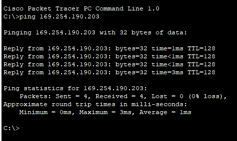

# Experiment 05: Design of a Complete Campus Area Network (CAN)

## 📋 Overview
A **Campus Area Network (CAN)** connects multiple local area networks (LANs) across an educational campus, university, or corporate enterprise. This capstone project integrates core networking principles into a unified, enterprise-grade architecture adhering to Cisco's **Hierarchical Network Design Model** (Core, Distribution, and Access Layers).

---

## 🎯 Objectives
- Design and simulate a scalable, redundant campus network in Cisco Packet Tracer.
- Implement Cisco's 3-tier hierarchical design:
  - **Core Layer**: High-speed backbone packet switching.
  - **Distribution Layer**: Policy-based connectivity, VLAN routing, and filtering.
  - **Access Layer**: Workgroup and end-user device attachment.
- Segment departments (e.g., Administration, Faculty, Students, Server Farm) into isolated **VLANs**.
- Implement **Inter-VLAN routing** to allow controlled cross-department communication.
- Deploy essential network servers:
  - **DHCP Server**: Automated IP configuration and lease management.
  - **DNS Server**: Domain name translation for campus web portals.
  - **HTTP/Web Server & Email Server**: Internal institutional services.
- Configure dynamic routing (OSPF) across core routing engines.

---

## 🛠️ Hardware & Components Deployed
| Component Tier | Devices Used | Functional Responsibility |
| :--- | :--- | :--- |
| **Core Layer** | Cisco High-Performance Routers (e.g., 2811 / 2911) | High-speed routing without packet inspection delays. |
| **Distribution Layer** | Layer 3 Switches / Cisco 2960 Switches | Aggregates access switches, routes between VLANs, security policies. |
| **Access Layer** | Cisco Catalyst 2960 Switches, Wireless APs | Connects student workstations, faculty laptops, printers, Wi-Fi clients. |
| **Server Farm** | Dedicated Rack Servers | Hosts DHCP, DNS, Web, and Mail servers. |

---

## 📐 Enterprise Network Topology
The design features distinct subnets and VLANs organized by department, linked through access and distribution switches to the central core router and server farm.

### Campus Network Topology in Cisco Packet Tracer


---

## 🏢 Departmental Segmentation & VLAN Design
| Department / Zone | VLAN ID | Subnet CIDR | Default Gateway | Service Type |
| :--- | :--- | :--- | :--- | :--- |
| **Administration** | VLAN 10 | `192.168.10.0/24` | `192.168.10.1` | Static / DHCP |
| **Faculty & Staff** | VLAN 20 | `192.168.20.0/24` | `192.168.20.1` | DHCP |
| **Student Laboratories** | VLAN 30 | `192.168.30.0/24` | `192.168.30.1` | DHCP |
| **Server Farm** | VLAN 50 | `192.168.50.0/24` | `192.168.50.1` | Static Addressing |
| **Management / IT** | VLAN 99 | `192.168.99.0/24` | `192.168.99.1` | Secure Admin Access |

---

## ⚙️ Core Configuration Commands

### 1. VLAN & Trunking Setup (Cisco Switch)
```ios
Switch(config)# vlan 10
Switch(config-vlan)# name Administration
Switch(config)# vlan 20
Switch(config-vlan)# name Faculty
Switch(config)# vlan 30
Switch(config-vlan)# name Students
Switch(config)# exit

! Configure 802.1Q Trunk link to router
Switch(config)# interface GigabitEthernet0/1
Switch(config-if)# switchport mode trunk
Switch(config-if)# switchport trunk allowed vlan all
```

### 2. Router-on-a-Stick (Inter-VLAN Routing)
```ios
Router(config)# interface GigabitEthernet0/0.10
Router(config-subif)# encapsulation dot1Q 10
Router(config-subif)# ip address 192.168.10.1 255.255.255.0

Router(config)# interface GigabitEthernet0/0.20
Router(config-subif)# encapsulation dot1Q 20
Router(config-subif)# ip address 192.168.20.1 255.255.255.0

Router(config)# interface GigabitEthernet0/0.30
Router(config-subif)# encapsulation dot1Q 30
Router(config-subif)# ip address 192.168.30.1 255.255.255.0
```

---

## 📊 Results & End-to-End Verification
All workstations receive dynamic IP parameters via DHCP, resolve internal campus domains via DNS, browse web services, and successfully ping across inter-VLAN subnets.



---

## 📁 Included Simulation File
- [`Final_Project_CampusNetwork.pkt`](./Final_Project_CampusNetwork.pkt): Complete working Cisco Packet Tracer simulation file.

---

## 📚 References & Acknowledgments
- Architecture adapted from academic network design references: [Campus Network System (GitHub)](https://github.com/Anas436/Campus-Network-System-Using-Cisco-Packet-Tracer).
