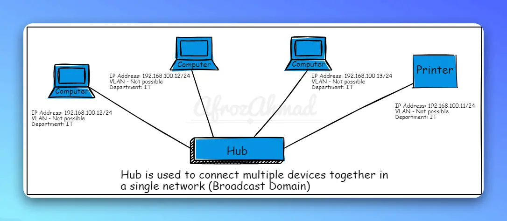
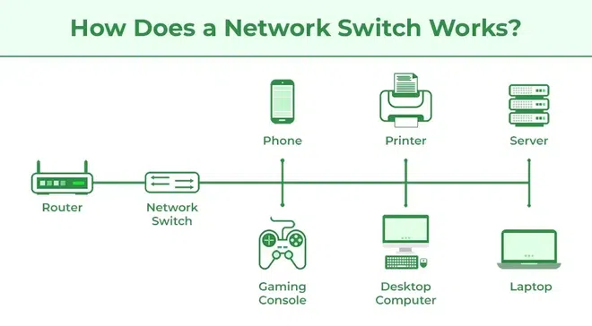
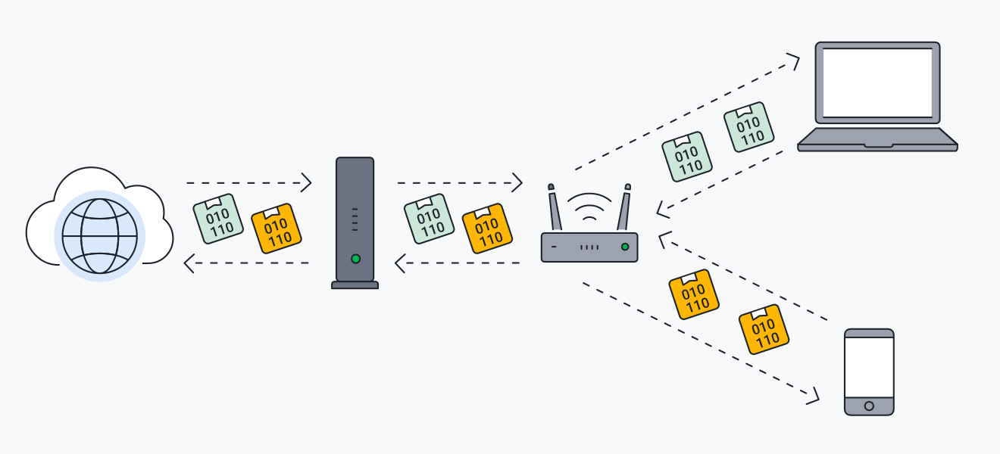
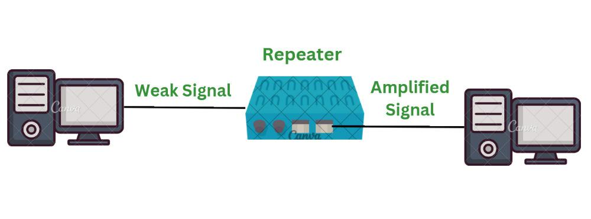
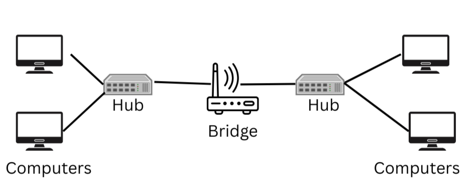
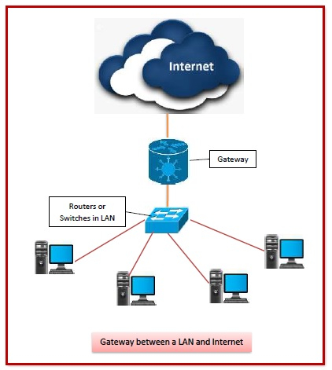
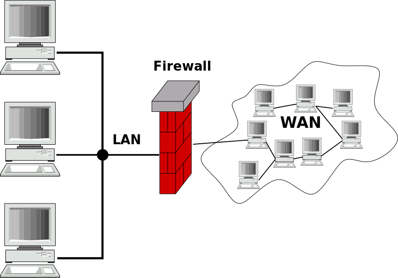

# Course Assignment: Common Network Devices

This folder contains the official theory assignment examining the architecture, OSI layer placement, operational principles, advantages, disadvantages, and real-world industrial applications of standard networking devices.

---

## 📄 Downloadable Assignment Documents
- 📕 [**CN-Assignment-Network-Devices.pdf**](./CN-Assignment-Network-Devices.pdf) *(Formatted submission PDF, 4.2 MB)*
- 📘 [**CN-Assignment-Network-Devices.docx**](./CN-Assignment-Network-Devices.docx) *(Editable Microsoft Word Document)*

---

## 📑 Assignment Contents & Overview

### 1. Hub

- **Definition**: A non-intelligent central hardware device that connects multiple computers in a Local Area Network (LAN).
- **OSI Layer**: **Physical Layer (Layer 1)**.
- **Working Principle**: When a host transmits a data packet, the hub blindly broadcasts the electronic signal to all connected ports. Only the intended destination processes the frame, while other nodes discard it, creating unnecessary network bandwidth consumption.
- **Advantages**: Inexpensive, plug-and-play simplicity.
- **Disadvantages**: Heavy network congestion, frequent packet collisions (single collision domain), zero packet filtering, zero security.
- **Real-Life Example**: Small legacy lab or training center linking a few PCs for simple ad-hoc file sharing.

---

### 2. Switch

- **Definition**: An intelligent multi-port network bridge that forwards data frames selectively within a LAN.
- **OSI Layer**: **Data Link Layer (Layer 2)** *(Layer 3 switches also handle IP routing)*.
- **Working Principle**: Switches inspect the destination **MAC address** of incoming frames and consult an internal **Content Addressable Memory (CAM) table**. Frames are forwarded exclusively to the designated destination port rather than broadcast.
- **Advantages**: Dedicated bandwidth per port, full-duplex transmission, drastically reduced collisions, high throughput.
- **Disadvantages**: Higher cost than hubs; requires configuration for VLANs, QoS, and STP in managed switches.
- **Real-Life Example**: University computer lab connecting 50+ workstations to provide high-speed local network and internet access.

---

### 3. Router

- **Definition**: A Layer 3 internetworking device that connects disparate networks (such as a local LAN to the global Internet or WAN).
- **OSI Layer**: **Network Layer (Layer 3)**.
- **Working Principle**: Reads logical destination **IP addresses**, consults dynamic or static **routing tables**, and determines the optimal next-hop path using routing protocols (OSPF, BGP, RIP). Also provides DHCP, Network Address Translation (NAT), and basic firewall filtering.
- **Advantages**: Connects distinct network architectures, segments broadcast domains, optimizes traffic paths.
- **Disadvantages**: Slower per-packet processing compared to pure Layer 2 switching; requires skilled administration.
- **Real-Life Example**: Home Wi-Fi Gateway linking smartphones, laptops, and smart TVs to an Internet Service Provider (ISP).

---

### 4. Repeater

- **Definition**: An electronic device that receives weak or attenuated network signals, cleans and amplifies them, and retransmits them at original strength.
- **OSI Layer**: **Physical Layer (Layer 1)**.
- **Working Principle**: Prevents signal degradation caused by physical media length limits (attenuation) over extended copper or wireless distances.
- **Advantages**: Extends network geographic coverage cheaply and transparently.
- **Disadvantages**: Cannot inspect, filter, or segment network traffic; amplifies noise along with the signal.
- **Real-Life Example**: Wi-Fi range extender used in multi-story homes or long warehouse corridors.

---

### 5. Bridge

- **Definition**: A network device used to join two separate local area network segments into a single cohesive logical network.
- **OSI Layer**: **Data Link Layer (Layer 2)**.
- **Working Principle**: Inspects MAC addresses of passing frames to decide whether to forward a frame across segments, filtering local traffic and isolating collision domains.
- **Advantages**: Divides large collision domains into smaller ones; improves network performance.
- **Disadvantages**: Slower than multi-port switches; limited functionality in modern gigabit topologies.
- **Real-Life Example**: Interconnecting an Accounting department LAN with an HR department LAN while filtering internal departmental broadcasts.

---

### 6. Gateway

- **Definition**: A specialized network node that connects two completely different network environments operating on distinct communication protocol stacks.
- **OSI Layer**: Multi-layer (**Transport, Session, Presentation, Application Layers**).
- **Working Principle**: Performs real-time protocol conversion, packet translation, data formatting, and rate matching between dissimilar networks (e.g., IPv4 to IPv6, or SNA to TCP/IP).
- **Advantages**: Enables interoperability across completely incompatible systems.
- **Disadvantages**: Computationally intensive; higher cost; introduces potential latency during protocol translation.
- **Real-Life Example**: Banking payment gateway translating ATM / banking legacy core networks to modern web API services.

---

### 7. Firewall

- **Definition**: A security appliance (hardware or software) that inspects, monitors, and regulates incoming and outgoing network traffic based on strict security rules.
- **OSI Layer**: **Network Layer (Layer 3) through Application Layer (Layer 7)**.
- **Working Principle**: Evaluates every packet against predefined **Access Control Lists (ACLs)**, stateful inspection tables, and deep packet inspection (DPI) signatures. Blocks unauthorized ports, prevents DDoS, malware, and intrusion attempts.
- **Advantages**: Crucial cyber defense barrier, prevents unauthorized access, safeguards internal networks.
- **Disadvantages**: Can introduce throughput bottlenecks if improperly scaled; requires ongoing rule maintenance.
- **Real-Life Example**: Campus boundary firewall filtering malicious traffic and preventing unauthorized access to examination and administrative servers.

---

## 📊 Summary Comparison Matrix

| Device | Primary OSI Layer | Addressing Used | Forwards To | Collision Domains | Broadcast Domains |
| :--- | :--- | :--- | :--- | :--- | :--- |
| **Hub** | Layer 1 (Physical) | None (Electrical bits) | All ports (Broadcast) | Single shared domain | Single shared domain |
| **Repeater** | Layer 1 (Physical) | None (Signal level) | Retransmit amplified | Single shared domain | Single shared domain |
| **Bridge** | Layer 2 (Data Link) | MAC Address | Specific segment | Splits into 2 domains | Single shared domain |
| **Switch** | Layer 2 (Data Link) | MAC Address | Specific port | 1 per port | 1 per VLAN |
| **Router** | Layer 3 (Network) | IP Address | Best path / Next hop | 1 per port | Splits broadcast domains |
| **Gateway** | Layer 4 - 7 (Application) | Protocols / APIs | Translated endpoint | Dependent on interface | Splits broadcast domains |
| **Firewall** | Layer 3 - 7 (Multi-Layer) | IP, Port, Payload | Permitted ports only | Dependent on interface | Splits broadcast domains |
