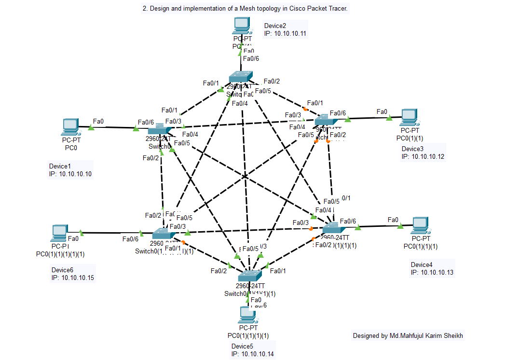
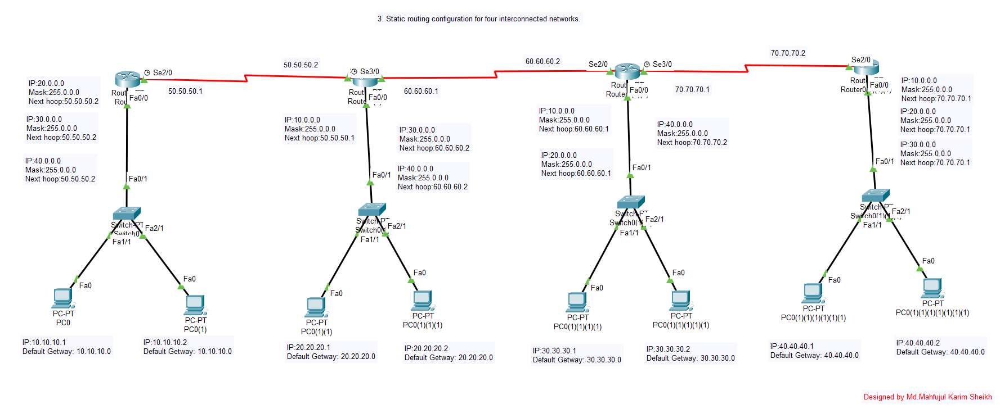
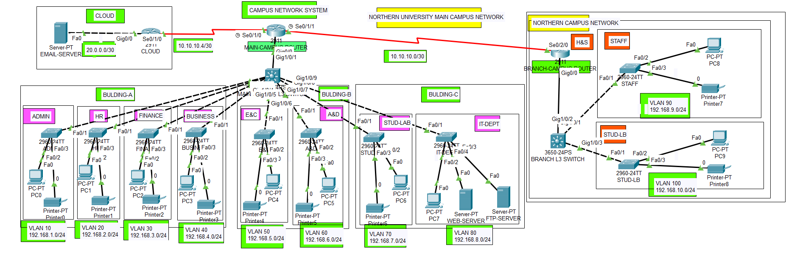

# 🌐 Computer Network Laboratory

<div align="center">

[](https://www.netacad.com/courses/packet-tracer)
[](#)
[](./LICENSE)
[](#)

<p align="center">
  <b>A comprehensive laboratory repository featuring Cisco Packet Tracer simulations, network topology designs, static & dynamic routing implementations, enterprise campus network architecture, assignments, and formal lab reports.</b>
</p>

[Explore Experiments](#-core-laboratory-experiments) •
[Network Topologies](#1-network-topologies) •
[Routing Configurations](#2-routing-configurations) •
[Campus Network](#3-campus-area-network-capstone-project) •
[Assignments & Reports](#5-assignments--lab-reports) •
[How to Run](#-how-to-run-simulations)

---

</div>

## 📖 Table of Contents
- [📌 Repository Overview](#-repository-overview)
- [🧪 Core Laboratory Experiments](#-core-laboratory-experiments)
- [📁 Modular Walkthroughs](#-modular-walkthroughs)
  - [1. Network Topologies (Star, Mesh, Bus)](#1-network-topologies)
  - [2. Routing Configurations (Static & Dynamic)](#2-routing-configurations)
  - [3. Campus Area Network (Capstone Project)](#3-campus-area-network-capstone-project)
  - [4. Practice Drills & Exercises](#4-practice-drills--exercises)
  - [5. Assignments & Lab Reports](#5-assignments--lab-reports)
- [🚀 How to Run Simulations](#-how-to-run-simulations)
- [📂 Repository Directory Structure](#-repository-directory-structure)
- [📄 License & Credits](#-license--credits)

---

## 📌 Repository Overview

This repository documents the complete coursework and laboratory implementations for the **Computer Network Laboratory** (7th Semester). It covers theoretical foundations, design methodologies, Cisco IOS CLI configurations, and practical simulations across:
- **Local Area Network (LAN) Architectures**: Bus, Star, and Mesh topologies.
- **Layer 3 Inter-Network Routing**: Static routing and dynamic interior gateway protocols (**RIPv2**, **OSPF**).
- **Enterprise Network Engineering**: 3-tier hierarchical campus network with **VLANs**, **Inter-VLAN routing (802.1Q)**, **DHCP**, **DNS**, and **Web/Mail servers**.
- **Theoretical Research**: Analysis of 7 essential networking devices, their OSI layer mappings, and real-world industrial deployments.

---

## 🧪 Core Laboratory Experiments

| Exp. No | Experiment Name | Key Concepts & Protocols | Cisco Devices | Simulation File (.pkt) | Documentation |
| :---: | :--- | :--- | :--- | :---: | :---: |
| **01** | **Star Topology Implementation** | Star architecture, CAM table learning, end-device IP configuration | Cisco Catalyst 2960 Switch, 6 PCs | [`star_topology.pkt`](./01-Network-Topologies/Lab01-Star-Topology/star_topology.pkt) | [View Guide](./01-Network-Topologies/Lab01-Star-Topology/) |
| **02** | **Mesh Topology Implementation** | Point-to-point links, redundancy, link formula $\frac{N(N-1)}{2}$, STP loops | 6 Switches, 6 PCs | [`mesh_topology_switch.pkt`](./01-Network-Topologies/Lab02-Mesh-Topology/mesh_topology_switch.pkt) | [View Guide](./01-Network-Topologies/Lab02-Mesh-Topology/) |
| **03** | **Static Routing for 4 Networks** | Manual routing tables, Next-Hop IP, `ip route` syntax | 4 Cisco Routers, 4 Switches, 8 PCs | [`four_router_static.pkt`](./02-Routing-Configurations/Lab03-Static-Routing/four_router_static.pkt) | [View Guide](./02-Routing-Configurations/Lab03-Static-Routing/) |
| **04** | **Dynamic Routing for 4 Networks** | Automatic route discovery, metric convergence, RIPv2 / OSPF | 4 Cisco Routers, 4 Switches, 8 PCs | [`four_router_dynamic.pkt`](./02-Routing-Configurations/Lab04-Dynamic-Routing/four_router_dynamic.pkt) | [View Guide](./02-Routing-Configurations/Lab04-Dynamic-Routing/) |
| **05** | **Complete Campus Area Network** | Core/Distribution/Access hierarchy, VLANs, Inter-VLAN routing, DHCP, DNS, Web | Multi-router core, Access switches, Servers | [`Final_Project_CampusNetwork.pkt`](./03-Campus-Area-Network/Final_Project_CampusNetwork.pkt) | [View Guide](./03-Campus-Area-Network/) |

---

## 📁 Modular Walkthroughs

### 1. Network Topologies
Located in [`01-Network-Topologies/`](./01-Network-Topologies/):
- **[Lab 01: Star Topology](./01-Network-Topologies/Lab01-Star-Topology/)**: Evaluates central switch frame distribution and port isolation.
  <br>
- **[Lab 02: Mesh Topology](./01-Network-Topologies/Lab02-Mesh-Topology/)**: Demonstrates physical link redundancy and fault recovery.
  <br>
- **[Bus Topology](./01-Network-Topologies/Bus-Topology/)**: Legacy shared-bus simulation with theoretical analysis and PDF guide.

---

### 2. Routing Configurations
Located in [`02-Routing-Configurations/`](./02-Routing-Configurations/):
- **[Lab 03: Static Routing](./02-Routing-Configurations/Lab03-Static-Routing/)**: Explicit configuration of static routing paths between subnets using the Cisco IOS command:
  ```ios
  Router(config)# ip route <remote-net> <net-mask> <next-hop-ip>
  ```
  <br>
- **[Lab 04: Dynamic Routing](./02-Routing-Configurations/Lab04-Dynamic-Routing/)**: Dynamic route advertisement using RIPv2 / OSPF with automatic failure convergence.
  <br>

---

### 3. Campus Area Network (Capstone Project)
Located in [`03-Campus-Area-Network/`](./03-Campus-Area-Network/):
- Complete enterprise-grade design utilizing Cisco's **Hierarchical Network Model**:
  - **Core Layer**: High-speed backbone packet routing.
  - **Distribution Layer**: VLAN aggregation, access policies, and inter-VLAN routing (Router-on-a-Stick).
  - **Access Layer**: User endpoints across Administrative, Faculty, and Student sectors.
  - **Server Farm**: Centralized DHCP (dynamic IP provisioning), DNS, Web, and Mail servers.
  <br>

---

### 4. Practice Drills & Exercises
Located in [`04-Practice-and-Exercises/`](./04-Practice-and-Exercises/):
- Practical drill topologies ([`p1.pkt`](./04-Practice-and-Exercises/p1.pkt), [`p2.pkt`](./04-Practice-and-Exercises/p2.pkt), [`p3.pkt`](./04-Practice-and-Exercises/p3.pkt), [`p4.pkt`](./04-Practice-and-Exercises/p4.pkt)) designed for laboratory exam preparation and troubleshooting practice.

---

### 5. Assignments & Lab Reports
- **[Course Assignment on Common Network Devices](./05-Assignments/)**:
  - Comprehensive report on **Hub, Switch, Router, Repeater, Bridge, Gateway, and Firewall** with OSI layer mappings, working mechanisms, pros/cons, and real-life deployment examples.
  - Includes [`CN-Assignment-Network-Devices.pdf`](./05-Assignments/CN-Assignment-Network-Devices.pdf) and editable Word version.
- **[Official Laboratory Reports](./06-Lab-Reports/)**:
  - Full compiled lab manual with cover page, experiment methodologies, and verified simulation outputs.
  - Includes [`CN-Lab-Report-Complete.pdf`](./06-Lab-Reports/CN-Lab-Report-Complete.pdf) and editable Word version.

---

## 🚀 How to Run Simulations

1. **Prerequisites**:
   - Download and install **[Cisco Packet Tracer](https://www.netacad.com/courses/packet-tracer)** (Version 8.0 or newer recommended).
2. **Clone the Repository**:
   ```bash
   git clone https://github.com/mahfuj735/Computer-Network-Lab.git
   cd Computer-Network-Lab
   ```
3. **Open Simulation Files**:
   - Double-click any `.pkt` file inside the experiment directories (e.g., `01-Network-Topologies/Lab01-Star-Topology/star_topology.pkt`).
4. **Test & Verify**:
   - Switch to **Realtime Mode** to allow Spanning Tree and routing protocols to converge (wait until amber lights turn green, or use the *Fast Forward Time* button).
   - Open any PC, click on the **Desktop** tab -> **Command Prompt**, and test reachability:
     ```cmd
     ping <destination_ip>
     ```
   - Switch to **Simulation Mode** (Shift + S) to inspect packet headers (PDU details) across OSI layers.

---

## 📂 Repository Directory Structure

```text
Computer-Network-Lab/
├── .gitignore                                      # Excludes temp & OS metadata
├── LICENSE                                         # GNU General Public License v3.0
├── README.md                                       # Master repository documentation
│
├── 01-Network-Topologies/                          # Basic LAN Topologies
│   ├── README.md                                   # Module documentation
│   ├── Lab01-Star-Topology/                        # Experiment 01
│   │   ├── README.md
│   │   ├── star_topology.pkt
│   │   ├── star_topology_alt.pkt
│   │   └── assets/ (topology & ping images)
│   ├── Lab02-Mesh-Topology/                        # Experiment 02
│   │   ├── README.md
│   │   ├── mesh_topology_switch.pkt
│   │   ├── mesh_topology_hw.pkt
│   │   └── assets/ (topology & ping images)
│   └── Bus-Topology/                               # Supplemental Lab
│       ├── README.md
│       ├── bus_topology.pkt
│       └── Bus_Topology_Guide.pdf
│
├── 02-Routing-Configurations/                      # Layer 3 Routing
│   ├── README.md                                   # Module documentation & CLI cheatsheet
│   ├── Lab03-Static-Routing/                       # Experiment 03
│   │   ├── README.md
│   │   ├── four_router_static.pkt
│   │   ├── three_router_static.pkt
│   │   ├── static_network_config_corrected.pkt
│   │   ├── three_router_static_alt.pkt
│   │   └── assets/ (topology & ping images)
│   └── Lab04-Dynamic-Routing/                      # Experiment 04
│       ├── README.md
│       ├── four_router_dynamic.pkt
│       ├── three_router_dynamic.pkt
│       └── assets/ (topology & ping images)
│
├── 03-Campus-Area-Network/                         # Experiment 05 / Capstone
│   ├── README.md
│   ├── Final_Project_CampusNetwork.pkt
│   └── assets/ (campus architecture & verification images)
│
├── 04-Practice-and-Exercises/                      # Exam practice & drills
│   ├── README.md
│   ├── p1.pkt
│   ├── p2.pkt
│   ├── p3.pkt
│   └── p4.pkt
│
├── 05-Assignments/                                 # Theory Assignment
│   ├── README.md                                   # Illustrated guide to 7 network devices
│   ├── CN-Assignment-Network-Devices.pdf
│   ├── CN-Assignment-Network-Devices.docx
│   └── assets/ (device diagrams)
│
├── 06-Lab-Reports/                                 # Official Lab Manual
│   ├── README.md
│   ├── CN-Lab-Report-Complete.pdf
│   ├── CN-Lab-Report-Complete.docx
│   ├── CoverPage.pdf
│   └── page5.pdf
│
├── Dynamic Router Configuration/                   # Original YouTube video linked setup
│   └── three_router(dynamic).pkt
│
└── Static Router Configuration/                    # Original YouTube video linked setup
    └── three_router(static).pkt
```

---

## 📄 License & Credits

- This repository is published under the [GNU General Public License v3.0](./LICENSE).
- Created for academic learning and computer networking laboratory coursework.